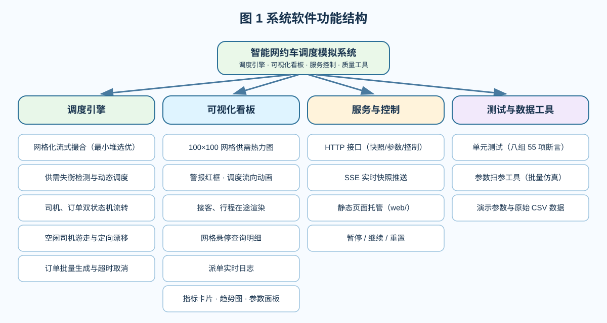
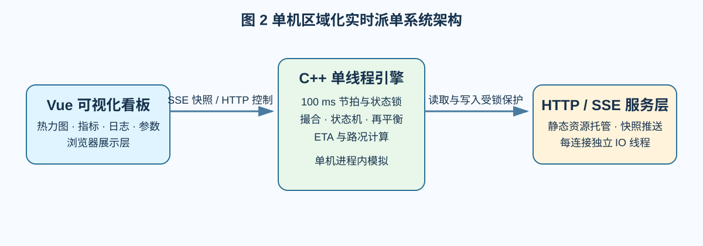
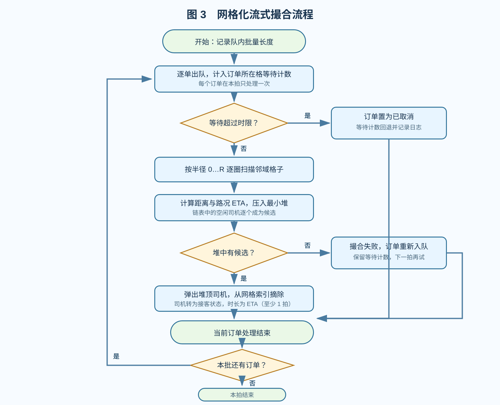
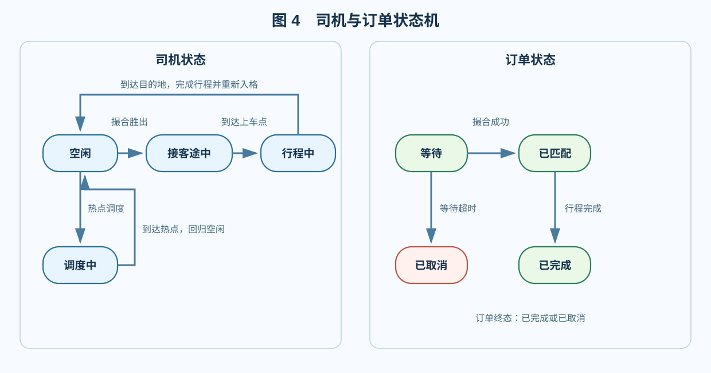
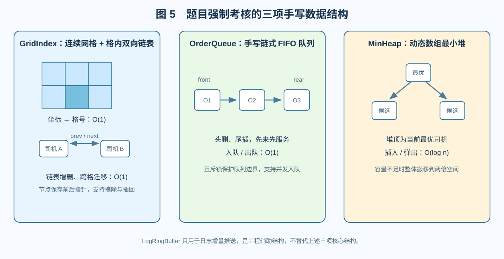
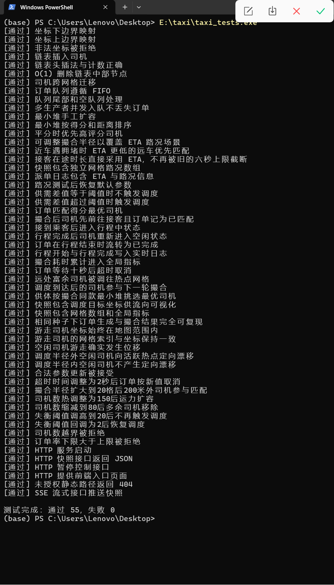
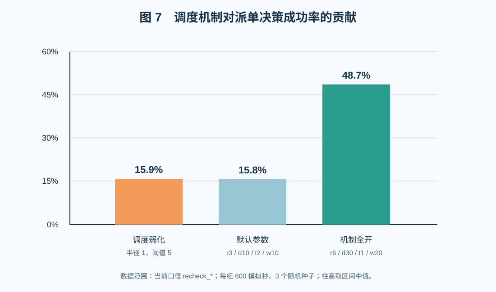
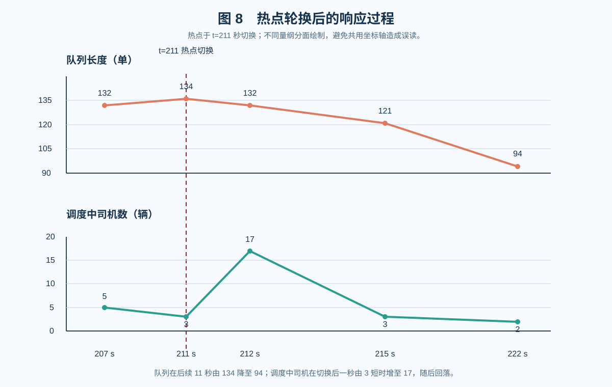
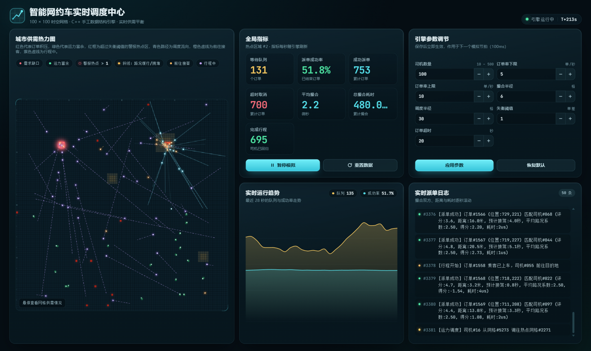
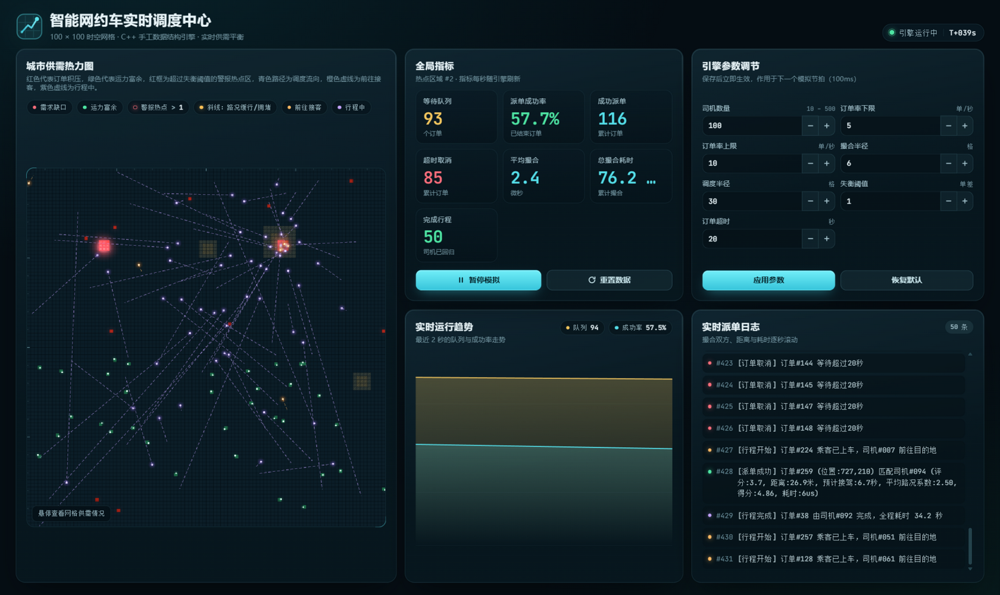

# 《数据结构与算法设计》课程设计总结报告

题目：智能网约车平台区域实时分布式派单与动态运力调度（题目 3）

学号：2452273
姓名：胡懿晨
专业：数据科学与大数据技术
指导教师：柳先辉
完成日期：2026 年 9 月 6 日

## 目录

第一部分 课程设计内容
　　1.1 题目
　　1.2 软件功能
　　1.3 设计思想
　　1.4 逻辑结构与物理结构
　　1.5 开发平台
　　1.6 系统的运行结果分析说明
　　1.7 系统安装、运行与操作说明
第二部分 实践总结
　　2.1 所做的工作
　　2.2 总结与收获
第三部分 参考文献

# 第一部分 课程设计内容

## 1.1 题目

本次课程设计选定题目 3：智能网约车平台区域实时分布式派单与动态运力调度。

题目要求在 1000×1000 的虚拟城市中手工实现一套简化的时空数据流缓存与撮合引擎：将城市均匀划分为网格矩阵，每格维护空闲司机链表，坐标可 O(1) 定位；乘客呼叫订单进入先来先服务的队列；撮合时流式扫描周边网格，把候选司机的代价分数压入手工实现的最小堆，堆顶即最优匹配。系统还需检测供需失衡（网格内订单数减空车数超过阈值即标记红色警报热点区），自动把相邻区域的富余运力调度过去，并处理司机接单、订单超时取消等状态流转。模拟场景设定为 100 辆带评分的出租车、每秒产生 5 到 10 个订单，且部分区域订单率刻意调高。最后要求开发网格供需热力面板、派单实时看板与全局指标统计，把调度机制引起的运力转移过程呈现出来。

拆解下来，题目考核三条主线：一是数据结构设计能力，网格索引、队列、最小堆三个结构必须纯手工构建，禁止调用高级语言内置的封装集合库，也禁止使用第三方空间数据库；二是算法设计能力，撮合、调度、状态机三套逻辑要在统一的模拟时钟下正确协作；三是工程系统化思维，模拟器、可视化、指标统计要构成一个能实际运行、能被观察验证的完整系统。本设计对三条主线分别对应 1.4 节、1.3 节和 1.2、1.6、1.7 节。

## 1.2 软件功能

系统由 C++ 模拟引擎和 Web 可视化看板两部分组成。引擎启动后在 8080 端口提供 HTTP 服务并托管看板页面，浏览器打开即用；两者之间以 SSE（Server-Sent Events）长连接实时同步状态，数据一变即推送，不依赖轮询。系统功能划分为调度引擎、可视化看板、服务控制与质量工具四个部分，整体结构如图 1 所示，逐项功能说明如下。



1. **网格化流式撮合。** 订单按先来先服务出队，撮合时扫描订单所在格及半径内相邻格的空闲司机，估算考虑路况的预计接驾时间（ETA），以 `Score = ETA − α×Rating` 为代价分数压入最小堆，其中 α=0.5 秒/评分点，堆顶司机胜出并立即从空间索引移除，随后按该 ETA 前往上车点，接到乘客后进入 8 到 20 秒的行程。
2. **供需失衡检测与动态调度。** 引擎逐拍统计每格"订单数 − 空车数"，差值严格超过阈值即标记为警报热点，从调度半径内的富余网格按同款评分挑选最优供体司机，修改其坐标派往热点格，到达后回归空闲参与撮合。热点每 30 模拟秒在三处坐标间轮换，80% 的订单集中在活跃热点内，失衡场景由构造保证。
3. **状态机流转。** 司机有空闲、接客途中、行程中、调度中四个状态；订单有等待、已匹配、已完成、已取消四个状态。订单等待超过时限（默认 10 秒，可调）自动取消；行程到达目的地才算完成，并计入完成指标。
4. **空闲司机游走。** 空闲司机每拍有 5% 概率向八邻域随机移动一格（平均每秒 0.5 步），调度半径之外的司机迈步时以 70% 概率朝活跃热点方向漂移，避免运力永久滞留在撮合范围之外；游走随时可能被撮合或调度打断。
5. **可视化看板。** 100×100 网格供需热力图（订单积压变红、运力富余变绿，路况以斜线叠层表示，超过阈值的格子画红色警报框并呼吸闪烁）、调度流向动画（起点到热点格的渐隐路径，司机点沿线移动）、接客与行程在途路径渲染（橙色、紫色虚线逐拍推进）、悬停查询任意格子的供需与路况明细、实时派单日志、七项全局指标卡片（队列长度、派单成功率、成功/取消/完成计数、平均与总撮合耗时）、36 秒窗口的趋势图，以及运行时参数调节面板（司机数、订单率、撮合半径、调度半径、失衡阈值、订单超时均可热更新，保存即生效于下一拍）。
6. **控制接口。** 看板按钮之外，暂停、继续、重置与参数修改均开放了同等的 HTTP 接口，可用脚本程序化操作；非法参数返回 400 并拒绝对状态做任何修改。
7. **测试与参数分析工具。** 单元测试覆盖八组共 55 项断言（见 1.6 节）；另有参数扫参工具以测试模式驱动同一引擎批量仿真，输出逐秒指标与事件统计，1.6 节的分析结论均出自该工具的原始数据。

看板"实时派单日志"是撮合过程的直接记录，每条日志给出匹配双方与代价细节。下面几行是实际运行时的输出样例：

```
[派单成功] 订单#1025 (位置:450,320) 匹配司机#088 (评分:4.9, 距离:120.0米, 预计接驾:16.2秒, 平均路况系数:1.35, 得分:13.75, 耗时:37us)
[行程开始] 订单#1025 乘客已上车，司机#088 前往目的地
[运力调度] 司机#52 从网格#4321 调往热点网格#4545
[行程完成] 订单#1025 由司机#088 完成，全程耗时 34.2 秒
[订单取消] 订单#1031 等待超过10秒
```

第一条里，评分 4.9、直线距离 120 米的司机因为接驾路径穿过拥堵区（平均路况系数 1.35），预计接驾 16.2 秒，代价分数 13.75 = 16.2 −（0.5 秒/评分点）×4.9；撮合本身的耗时只有 37 微秒。距离、ETA、路况、得分、耗时五项数字彼此自洽，可以逐条对表验证。

## 1.3 设计思想

### 1.3.1 总体架构与节拍循环

系统分三层：引擎核心层是单线程节拍驱动；服务层是多线程 IO，HTTP 服务为每个连接开线程，SSE 推送与控制接口都落在这一层；展示层是浏览器里的 Vue 看板，只消费快照，不参与任何计算决策。引擎核心由一个调度线程驱动，每 100 毫秒执行一拍（每模拟秒 10 拍），一拍内的全部状态变更在同一把状态锁内按固定顺序进行：

```cpp
void Simulator::executeTick() {
    const std::uint64_t currentTick = tick_.fetch_add(1) + 1;
    std::lock_guard<std::mutex> lock(stateMutex_);
    if (currentTick % kTrafficRefreshTicks == 0) refreshTrafficLocked(currentTick);
    processDriverTransitionsLocked(currentTick);        // 司机状态回退与空闲游走
    if (autoGenerate_ && currentTick % kTicksPerSecond == 0)
        generateOrderBatchLocked(currentTick);          // 每个模拟秒批量生成订单
    processOrdersLocked(currentTick);                   // 批量撮合
    rebalanceLocked(currentTick);                       // 失衡检测与动态调度
}
```

这个顺序是刻意安排的。司机状态推进放在撮合之前，使上一拍完成调度、已回归空闲状态的司机能够先重新入格，并在本拍参与撮合；到达上车点的司机则由接客途中转入行程中，继续执行行程。订单生成放在撮合之前，新订单当拍即有被匹配的机会；调度放在撮合之后，用的供需计数是本拍撮合后的最新值，避免给刚刚已有车赶往的格子重复派车。所有以秒计的时长（接客 ETA、行程 8–20 秒、调度 2 秒、订单超时）都以拍数存储，按 `kTicksPerSecond` 与秒互转，节拍快慢不影响秒语义。

选择单线程节拍制而不是多线程并发撮合，主要有两个原因。其一是确定性：订单生成与撮合共用同一随机序列，相同随机种子下整个模拟过程可以逐拍复现，测试 `testDeterminism` 验证了这一点，演示或测试翻车时用相同种子即可重放同一过程。其二是正确性更容易保证：撮合要维护"司机从索引移除、状态回退、计数增减"这一串不变量，单线程内串行执行杜绝了竞态。并发能力没有省掉，而是放到了 IO 层：订单队列自带互斥锁，快照读取由状态锁保护，HTTP 连接彼此独立。

本课程设计在**单机进程内模拟区域化实时派单**，重点验证手写数据结构与调度算法；核心状态采用单线程 100 ms 节拍保证一致性，网络 IO 使用多线程。题目中的“分布式”在此对应网格化区域分治与运力分散，而非真实多节点分布式集群或高并发撮合服务。



### 1.3.2 代价分数与路况 ETA 模型

题目背景明确指出派单要同时考虑空间邻近、路况时间邻近与司机评分，参考公式为 Score = 距离 − 司机评分。真实网约车平台还会把实时订单、司机位置、响应时间和长期车辆价值纳入在线决策；相关研究分别采用学习与规划、强化学习及动态车辆—请求分配方法处理这类问题[7][8][12]。受课程设计规模与手写数据结构要求限制，本设计不求解工业系统中的长期序贯决策问题，而是在简化场景下采用可解释的局部代价函数。本设计把题目公式中的"距离"升级为按路况加权的接驾 ETA（秒），定义评分奖励系数 α=0.5 秒/评分点，并采用 `Score = ETA − α×Rating`：分数低意味着司机既能更快接到乘客、评分又高。该公式是本课程设计为演示多因素撮合而设定的启发式规则，并非直接复现现有工业派单算法。ETA 的估算不引入路网拓扑，而是把起点到终点的直线按穿越的网格分段，读取每段中点所在格的道路通行系数加权后，再除以基准车速 10 米/秒。

路况场是叠加在网格索引上的系数层：畅通 1.0、缓行 1.5、拥堵 2.5，每 5 模拟秒刷新一次。活跃热点区域整体覆盖 1.5 倍系数（核心 2.5 倍），另有两处位置随时间漂移的周期性事故点，构造出动态变化的通行环境。这样同一个司机在不同时刻的 ETA 不同，撮合结果会随路况漂移而变化，也为 1.6 节的路况可见性分析提供了素材。

距离没有从评分中丢弃，而是作为同分决胜项保留在比较函数里。完整决胜链是：分数小者优先，同分比距离近者，同距比评分高者，仍平分比编号小者。

浮点数经不同路径累加后可能只在 1e-9 的量级上有差异，直接比较会把这种噪声放大成结果抖动，所以每一级比较都带容差。这条决胜链的作用是把撮合结果完全确定化：任何两个候选之间必分胜负，且胜负规则与遍历顺序无关，相同种子下逐拍可复现。

### 1.3.3 网格化流式撮合流程

网约车派单的核心问题是根据实时订单、司机位置及供需状态完成司机与请求的匹配[7]。已有时空索引研究会先缩小候选车辆搜索范围，再执行可行候选检索[9]；这与本设计“先扫描局部网格、再用最小堆选优”的分层思路相近。受课程设计的规模和数据结构要求限制，本设计采用 FCFS 订单队列与局部候选最小堆完成逐单贪心撮合，重点展示空间索引、队列和堆三类结构的协作，而不实现全局联合优化。

撮合在每一拍对订单队列整体执行一遍：先记录当前队列长度作为本轮批量，然后逐单出队。对每个订单的处理流程是：

1. 计算订单所在格子，将该格的等待计数加一（前端热力图与失衡检测共用此计数）；
2. 检查订单是否已等待超过时限，超时则置为已取消、计数回退、记日志；
3. 以订单格为圆心，按半径 0,1,2,…,R 逐圈扫描格子（R 为撮合半径），把每格链表中的空闲司机逐个取出，计算直线距离与路况 ETA，压入最小堆；
4. 弹出堆顶作为胜者，将其从空间索引摘除，司机转入接客状态，接驾时长按撮合用的 ETA 换算为节拍数（至少一拍，保证状态可见），订单转为已匹配并按司机槽位关联记录；
5. 堆为空则订单重新入队，留待下一拍再试。

全流程有两次分支——等待超时与堆空——其走向如图 3 所示，撮合失败的订单以重新入队而非丢弃收场，配合超时取消形成完整闭环。



第 3 步的核心循环如下（节选）：

```cpp
for (int radius = 0; radius <= params_.matchRadius; ++radius) {
    for (int offsetY = -radius; offsetY <= radius; ++offsetY) {
        for (int offsetX = -radius; offsetX <= radius; ++offsetX) {
            if (std::max(std::abs(offsetX), std::abs(offsetY)) != radius)
                continue;                        // 只扫第 radius 圈的新增格子
            ...
            Driver* current = grid_.cell(cellX, cellY).head;
            while (current != nullptr) {         // 遍历该格空闲司机链表
                const double candidateEta = estimateTravelTimeLocked(
                    current->x, current->y, order.x, order.y);
                candidates.push(MatchCandidate{
                    current,
                    candidateEta - kRatingTimeCreditSeconds * current->rating,
                    candidateDistance, candidateEta});
                current = current->next;
            }
        }
    }
}
```

逐圈而不是整块扫描，好处是撮合半径缩小时天然贴近题目"扫描当前网格及相邻网格"的字面语义，半径放大时也只是多扫几圈，内圈结果不变。撮合半径为 R 时，最多访问 `(2R+1)²` 个格子；若候选司机数为 C、单次 ETA 估算采样格数为 D，则单次撮合开销可写为 `O(R² + C·D + C log C)`。坐标定位是 O(1)，但邻域扫描取决于半径和候选数量；以默认半径 3 计，最多扫描 49 格，实测的单次司机撮合耗时见 1.6 节。

### 1.3.4 供需失衡检测与动态调度

运力空间分布失衡是 Mobility-on-Demand 系统中的典型问题：不同区域的需求不均衡时，车辆会在部分区域积累，而高需求区域可能持续缺车，因此需要主动执行空驶车辆再平衡[10]。相关研究还从排队网络角度分析车辆可用率和再平衡策略[11]。本设计没有建立完整排队网络模型，而是采用更适合课程演示的网格级供需差作为实时信号，以 `pendingCount − idleCount` 衡量失衡，并从周边富余网格调入司机。每拍对全部 10000 个格子做一次线性扫描，差值严格超过失衡阈值的格子即为警报热点：

```cpp
// 节选自 Simulator::rebalanceLocked
GridCell& target = grid_.cell(targetX, targetY);
int imbalance = target.pendingCount - target.idleCount;
if (imbalance <= params_.imbalanceThreshold) continue;    // 严格超过才触发
...
while (imbalance > params_.imbalanceThreshold && moved < 2) {  // 每个目标热点格每拍至多调入 2 人
    Driver* donor = findDonorDriverLocked(targetX, targetY);
    if (donor == nullptr) break;
    grid_.removeDriver(donor);                   // 从原格链表摘除
    donor->state = DriverState::Rebalancing;
    donor->targetX = targetX * kCellSize + offset(schedulerRandom_);  // 热点格内随机落点
    donor->readyTick = currentTick + 2 * kTicksPerSecond;             // 调度行程固定 2 秒
    ...
}
```

供体的选取与撮合遵循同一套标准：从调度半径内的格子中只考虑"空车数多于等待数"的富余格，把其中的空闲司机按同款 ETA 评分压入最小堆，弹出堆顶即最快到位、评分最高的司机。两套决策共用一个"最快接驾"标准，平台给谁派单、从哪里调车的行为才对用户一致。供体司机转入调度状态，2 秒后到达热点格内一个随机落点，回归空闲并入格，参与下一轮撮合。

"严格超过"这个判据与题目原文对齐：差值等于阈值时不触发，测试里有专门断言覆盖这一边界。每个警报目标格每拍至多调入 2 名司机，防止单拍过度抽取周边运力；调度行程与距离无关地固定为 2 秒，是引擎的既有简化，2.2 节有讨论。

### 1.3.5 状态机流转与边界处理

司机与订单各自维护一个状态机，核心流转如下：

| 当前状态 | 触发事件 | 次态 |
| --- | --- | --- |
| 司机：空闲 | 撮合胜出 | 接客途中（按 ETA 计时） |
| 司机：接客途中 | 到达上车点 | 行程中（8–20 秒随机） |
| 司机：行程中 | 到达目的地 | 空闲（订单计完成） |
| 司机：调度中 | 到达热点格 | 空闲 |
| 订单：等待 | 撮合成功 | 已匹配 |
| 订单：已匹配 | 行程到达目的地 | 已完成 |
| 订单：等待 | 等待超过时限 | 已取消 |



边界情况的处理是状态机能不能自洽的关键，系统做了四件事。其一，撮合成功后司机立即从空间索引摘除，同一个司机不会被两个订单同时选中；在途订单按司机槽位关联存放，行程结束原地流转为已完成，订单与司机的对应关系全程唯一。其二，空闲司机游走与撮合、调度共用同一状态锁，游走的跨格移动经 `GridIndex::moveDriver` 完成，随时可能被撮合或调度打断，链表不变量始终成立。其三，运行时缩减司机数时，被裁撤司机身上的在途订单被主动置为已取消并记"服务中断"日志，避免订单悬空等一个永远不会来的司机。其四，撮合失败的订单重新入队而不是丢弃，等下一拍运力空出再试，配合超时取消形成"尽力撮合、过期放弃"的完整闭环。

### 1.3.6 可视化与引擎共用判据

看板不是事后拼接的报告页，而是引擎状态的实时投影：后端把每拍的网格供需计数、路况系数、司机四态坐标、指标与日志组成完整快照，经 SSE 推给前端；前端警报红框的判定条件与引擎调度触发条件完全相同（差值严格超过失衡阈值），阈值在面板上调整时红框数量随之增减，画面和机制不会出现两套口径。调度流向、接客虚线、行程虚线的动画时长分别与引擎的调度行程、接驾 ETA 对齐，屏幕上看到的司机位移速度就是引擎里真实的时间流逝。

## 1.4 逻辑结构与物理结构

四个底层结构全部位于 `src/manual_structures.*`，均为裸指针与原生数组的手写实现。题目强制考核的 **GridIndex、OrderQueue、MinHeap** 是下表中应重点展示的三项核心结构；LogRingBuffer 仅是支撑日志增量推送的工程辅助结构。先给出总览，再逐个说明。

| 结构 | 逻辑结构 | 物理结构 | 关键操作与复杂度 |
| --- | --- | --- | --- |
| GridIndex 网格空间索引 | 二维网格矩阵（线性结构的推广，空间局部查询） | 顺序存储：10000 个格子的连续数组，每格内嵌双向链表 | 坐标定位 O(1)；司机增、删、跨格迁移均 O(1) |
| OrderQueue 订单队列 | 线性结构：队列（操作受限的线性表，FCFS） | 链式存储：单链表，带头尾指针，互斥锁保护 | 入队、出队均 O(1) |
| MinHeap 最小堆 | 树形结构：完全二叉树（优先队列） | 顺序存储：动态数组，父子以下标换算，容量满时倍增扩容 | 插入、弹出 O(log n)，取堆顶 O(1) |
| LogRingBuffer 日志环形缓冲 | 线性结构：定长环形序列 | 顺序存储：固定 200 容量的数组，首指针取模回绕 | 写入 O(1)，按序号增量读取 O(k) |



司机与订单本身分别存放在 500 容量的槽位数组中（`Driver* drivers_`、`Order* activeOrders_`）。槽位制带来两个便利：司机与订单的关联用下标直接完成（撮合成功后订单按司机槽位关联记录，行程结束时原地流转为已完成），无需查找表；司机的双向链表指针直接挂在司机结构体内，索引操作零额外分配。

### 1.4.1 GridIndex：顺序存储的网格矩阵 + 链式存储的空闲司机链表

逻辑上它是一个 100×100 的网格矩阵，每格 10×10 米。大规模出租车服务中，利用时空索引缩小候选车辆搜索范围是一类常见思路，例如 T-Share 通过时空索引快速检索可能满足请求的候选出租车[9]；多维空间数据结构专著也系统讨论了网格化空间划分与度量空间检索[17]。本设计进一步按照课程题目的约束，将城市规则化为固定二维网格，以常数时间完成坐标到格子的映射。物理上采用"顺序 + 链式"的复合存储：10000 个格子按行优先压平进一个连续数组，坐标到格子的映射只需两次整除：

```cpp
int GridIndex::coordinateToCell(int value) {
    if (!validCoordinate(value)) return -1;
    return value / kCellSize;            // kCellSize = 10
}
int GridIndex::flatten(int cellX, int cellY) {
    if (cellX < 0 || cellX >= kGridSide || cellY < 0 || cellY >= kGridSide) return -1;
    return cellY * kGridSide + cellX;
}
```

两个函数都是纯静态方法，无任何状态访问，这就是题目要求的"根据坐标在 O(1) 时间内定位网格"。

每格的空闲司机串成一条双向链表。入格用头插法，司机节点记录自身格号；出格时利用前驱与后继指针直接摘除，因此撮合成功或司机下线时即使节点处于链表中部也无需从头查找。跨格移动封装为“从旧格摘除 → 更新坐标 → 插入新格”，保证坐标与链表索引同步，三项操作均为 O(1)。

格子内还缓存 `idleCount`（空闲司机数）与 `pendingCount`（等待订单数）两个计数，供需统计和失衡检测直接读计数，不必遍历链表；撮合、取消、完成时对应计数同步增减。这两个整数是热力图与调度机制共同的数据基础。

### 1.4.2 OrderQueue：带尾指针的单链表队列

逻辑上是先来先服务的 FIFO 队列。物理上用带头尾指针的单链表实现，入队接在尾部、出队取头部；空队列出队失败时同步维护尾指针，两个操作均为常数时间。

链上每个节点持有一份订单副本，出队时弹出并释放，队列自身不持有任何悬空引用。队列自带互斥锁，即使将来订单由其他线程投入，多生产者场景也不会丢数据，测试中用 4 线程并发入队 1000 单验证过这一点。

### 1.4.3 MinHeap：顺序存储的完全二叉最小堆

逻辑上是一棵完全二叉树形式的最小堆，堆顶是代价分数最小的候选。物理上用动态数组顺序存储，下标 i 的子女位于 2i+1 与 2i+2，不需要任何指针。插入时把新元素放到末尾，沿父链上浮：

```cpp
void MinHeap::push(const MatchCandidate& candidate) {
    if (size_ == capacity_) grow();       // 满 则申请两倍空间整体搬移
    std::size_t index = size_++;
    data_[index] = candidate;
    while (index > 0) {                   // 上浮：与父结点比较，小则交换
        const std::size_t parent = (index - 1) / 2;
        if (!candidateLess(data_[index], data_[parent])) break;
        swap(index, parent);
        index = parent;
    }
}
```

弹出时取走堆顶，把末元素换到堆顶后逐层下沉，每层在左右子女中选最小者交换，直到堆性质恢复，同为 O(log n)。撮合每拍都会发生、每单要把全部候选逐一压堆再取堆顶，堆的 O(log n) 插入弹出符合"流式产生候选、逐一取最优"的流程。需要如实区分复杂度：若一个订单有 C 个候选且最终只取一个最优司机，直接线性扫描全部候选即可在 O(C) 时间内得到最优值；当前实现逐个插入最小堆，开销为 O(C log C)。因此本设计采用最小堆主要是为了满足课程设计对堆结构的实现与应用要求，并使候选司机能够按统一规则动态进入优先队列；当需要继续取得 Top-k 候选或动态维护候选集合时，堆的可扩展性更有价值，而不是声称它在当前规模下具有绝对复杂度优势[2]。比较规则用 1.3.2 节的决胜链，保证堆内全序确定。

### 1.4.4 LogRingBuffer：定长环形缓冲

派单日志只关心最近发生的事件，物理上用定长 200 的数组构成环形缓冲。缓冲未满时从尾部追加，写满后覆盖最旧条目并将首指针取模回绕。

每条日志带单调递增的序号，HTTP 推送层按序号判断前端是否已见过这条日志，只发增量，看板因此能在不重复、不遗漏的前提下实时滚动，且内存占用恒定，长时间运行不增长。

### 1.4.5 合规性说明与选型讨论

核心数据结构及正式引擎实现未使用 STL 容器替代题目要求的网格索引、订单队列和最小堆，也未使用第三方空间库；候选排序完全由手写最小堆完成，未使用 `std::sort`。测试辅助代码 `tests/test_main.cpp` 为构造测试数据使用了 `std::vector` 等工具容器，但不参与核心数据结构或派单算法实现。正式引擎中使用的标准库设施仅限于线程同步原语（mutex、thread、condition_variable）、随机数发生器、字符串流与数值函数等。

与可能的替代方案相比：全局平衡树能做范围查询，但实现复杂且对"局部扫描"这个访问模式过度设计；哈希表定位快，却失去了"相邻网格"这一天然的空间序，失衡检测也退化为全表扫描；全局单链表每单撮合都要遍历 100 辆车，撮合频次一高就成瓶颈。网格矩阵把空间预先划分好，坐标定位和单格统计落在 O(1) 路径；邻域访问的开销则随撮合或调度半径及候选司机数量增长，正与本题局部扫描的访问模式相匹配。

## 1.5 开发平台

| 项目 | 环境 |
| --- | --- |
| 操作系统 | Windows 10/11 |
| 后端语言与编译器 | C++17，MSYS2 UCRT64 g++（-O2 -Wall -Wextra -pedantic），静态链接为单文件 exe |
| 构建 | Make（后端编译 + 前端构建一键完成，产物 taxi_simulator.exe 与 taxi_tests.exe） |
| 前端 | Vue 3 + TypeScript + Vite，构建产物输出到 web/ 目录由 C++ 服务直接托管 |
| 网络通信 | WinSock2 手写 HTTP 服务器（每连接一线程），SSE 实时推送 |
| 部署形态 | taxi_simulator.exe 连同 web/ 目录即为完整运行环境，无需安装运行库 |

两点工程选择补充说明。其一是静态链接：编译时加 `-static -static-libgcc -static-libstdc++`，运行时库直接编进可执行文件，交付时不存在"目标机器缺 DLL"的风险，拷贝即用。其二是前端产物由 C++ 服务托管而不是单独起 Node 服务：看板构建后就是一组静态文件，引擎进程顺便托管它们，交付形态收敛为"一个 exe + 一个目录"，也避免了课堂演示时多开进程。前端选用 Vue 只承担展示层职责，引擎侧的数据结构与算法不依赖任何第三方库。Vue 组件开发参照 Vue 官方文档[4]；WinSock2 接口使用 Microsoft Programmer's Reference[5]；看板实时推送采用浏览器 `EventSource` 与 `text/event-stream` 约定，遵循 WHATWG HTML Living Standard 的 Server-sent events 章节[6]。

## 1.6 系统的运行结果分析说明

### 1.6.1 实验数据口径与可追溯性

本节的参数结论只引用 `tools/results/` 中的 `recheck_*.csv` 与 `radiuscheck_*.csv`。这两类数据使用当前实现：接驾时长按路况 ETA 推进，失衡仅在差值**严格超过**阈值时触发。其余 CSV 是旧版实验，可能采用接驾时长钳制或旧触发语义，不参与本文结论。例如，在相同的 100 辆车、5–10 单/秒、`r6/d30/t1/w20` 配置下，当前口径的 `recheck_20260906.csv` 记录为 **48.69%**，而 `finetune_20260906.csv` 的 **61.21%** 属于旧口径，二者不可混用。

本次报告与数据校验的代码基线为 Git commit `6ea9e863e8debe96a50c26cb72e01811b9796ded`；推荐参数、随机种子和原始 CSV 的对应关系见 `参数调优分析.md`，便于复现和审阅。

### 1.6.2 功能测试

测试程序以 `-DTAXI_TESTING` 编译，该宏向测试开放引擎的受控接口：可以清空状态、手工布置司机与订单、逐拍驱动 `executeTick`，从而在确定性前提下对每条路径做精确断言。以下结果由当前源码重新编译后运行得到：共八组、55 项断言，全部通过。

| 测试组 | 覆盖内容 |
| --- | --- |
| 网格索引 | 坐标边界映射（0→0 格、999→99 格）、非法坐标拒绝、链表头插与 O(1) 删中部节点、跨格迁移后索引一致 |
| 订单队列 | FIFO 语义、空队列处理、4 线程并发入队 1000 单不丢失 |
| 最小堆 | 从容量 2 手工扩容、按分数与距离有序弹出、平分时高评分司机优先 |
| 撮合与调度算法 | 近车遇拥堵时 ETA 更低的远车胜出、差值等于阈值不触发调度（严格超过才触发）、接客/行程/完成全链路状态流转、超时取消、供体按同款堆评分选出、调度到达后参与下一轮撮合 |
| 确定性 | 相同种子下订单生成、撮合、取消、完成计数完全一致 |
| 空闲司机游走 | 坐标合法性、网格索引与坐标一致、位移确实发生、半径外定向漂移与半径内无定向分量 |
| 动态参数 | 超时/半径/阈值/司机数热更新即时生效，司机数增减运力正确，越界参数被拒绝 |
| HTTP 服务 | 快照接口、控制接口、静态页面、404 拦截、SSE 流式推送首帧可达 |

测试之外每次改动还做实机冒烟：启动真实 exe 观察看板行为与指标走势，确认测试口径与实机行为一致。



### 1.6.3 指标口径

看板与扫参工具共用一套指标定义，分析结论均基于以下口径：

| 指标 | 定义 |
| --- | --- |
| 派单决策成功率（简称“派单成功率”） | 累计成功匹配订单数 ÷（累计成功匹配订单数 + 累计取消订单数），衡量撮合决策的有效性；分子中的订单可仍处于接客或行程中 |
| 完成订单数 | 已到达目的地并由司机回归空闲状态的订单数，独立于派单决策成功率统计 |
| 司机空闲率 | 四态司机中处于空闲状态的平均占比，衡量运力利用程度 |
| 调度频次 | 每分钟"运力调度"日志条数，衡量调度机制的活跃程度 |
| 警报格数 | 差值严格超过失衡阈值的格子数，与前端红框同判据 |
| 平均/总撮合耗时 | 单次撮合耗时用 `steady_clock` 计量，微秒口径累计与求均值 |

### 1.6.4 供需格局测算

分析运行结果之前，先算清题目设定的供需背景。推荐参数下每单从生成到完成平均占用一辆司机约 18 秒（接驾均值约 4 秒，行程 8–20 秒）。订单均值 7.5 单/秒，对应运力需求约 7.5 × 18 = 135 个司机当量，而题目只给 100 辆车。在忽略空间错配、空驶移动和随机波动等因素的理想化条件下，100 辆车相对于这一持续服务需求的容量比例约为 100/135 ≈ 74%。该数值只用于说明当前参数下存在明显的供需压力，并不作为系统成功率的严格理论上限；实际结果还会受到空间摩擦、接驾时间、订单超时和车辆分布等因素影响。这个测算给后面的数字提供参照系——取消不是缺陷而是题目要求的状态流转，评价系统好坏的依据应是取消量是否可控、司机是否被充分利用[11]。

### 1.6.5 调度机制的量化贡献

固定供需不变，只调整调度侧参数做对照实验（每组 600 模拟秒、3 个随机种子，剔除前 60 秒的运力分布暂态）：

| 配置 | 派单成功率 | 司机空闲率 | 调度频次 |
| --- | --- | --- | --- |
| 调度弱化（调度半径 1、阈值 5） | 14.8–16.9% | 76–79% | 0 次/分 |
| 默认参数（撮合 3、调度 10、阈值 2、超时 10） | 15.1–16.5% | 77–79% | 33–37 次/分 |
| 机制全开（撮合 6、调度 30、阈值 1、超时 20） | 48.2–48.9% | 约 30% | 134–138 次/分 |

同样的车、同样的订单，失衡调度机制把成功率抬升约 3 倍，把闲置率从 78% 压到 30%。调度关闭时，绝大多数司机在远离热点处闲置，热点订单成批超时取消；机制全开时，热点周边常态保持约 12 个警报格、5 名司机在途调度，每分钟约 135 次调度把远端运力持续输送进热点。这组对照是整个系统价值最直接的证据。



### 1.6.6 各参数的单项效应

**撮合半径（3→12）存在温和峰值。** 接驾时长由 ETA 决定后，远距离撮合有了真实的时间代价：同种子下撮合半径 3/6/8/10/12 的成功率分别为 46.8% / 48.9% / 48.6% / 46.9% / 46.1%，半径 6 附近最优。半径越大，接驾 ETA 均值越长（半径 6→12 时由 4.1 秒升至 7.3 秒），司机被长途接驾占用越久，调度事件也随之变稀（135→84 次/分）。半径越小则调度戏份越足：半径 3 时调度事件 149–164 次/分，热点订单几乎完全依赖调度送车。

**调度半径 30 明显优于 20。** 调度行程固定 2 秒、与距离无关，拉大半径没有时效代价，只扩大供体池：同配比下半径 30 的成功率 48.2–48.9%，半径 20 只有 37.6–39.0%，差约 10 个百分点。

**失衡阈值取最低档。** 触发条件是差值严格超过阈值，阈值 1 即"差值 ≥2 就派车"，成功率 48.2–48.9%，阈值 2 为 46.7–48.4%，灵敏度更高且无副作用。

**订单超时 20 秒是平衡点。** 超时 15 秒成功率 44.5–45.5%（稳态队列约 85），20 秒 48.2–48.9%（约 108），25 秒 50.5–52.0%（约 134，且行程完成日志的全程耗时普遍超过 30 秒）。运力其实够服务大部分订单，订单只是需要等司机到位——超时过短把这部分订单白白浪费，过长则队列常年高位、观感像瘫痪，20 秒兼顾两者。

### 1.6.7 热点轮换的响应过程

监控热点切换瞬间（模拟时间 t=211 秒）的逐秒指标：

```
t=207  队列=132  调度中司机= 5  警报格= 9   （旧热点被逐步喂饱）
t=211  队列=134  调度中司机= 3  警报格=10   （热点切换，新热点警报格涌现）
t=212  队列=132  调度中司机=17  警报格=13   （调度流向冲向新热点，峰值）
t=215  队列=121  调度中司机= 3  警报格=16   （救援到位）
t=222  队列= 94  调度中司机= 2  警报格=16   （新热点周边运力就位）
```

热点切换后 1 秒内调度流向冲向新热点（"调度中"司机 3→17），10 秒左右运力就位、队列从 134 回落到 94。警报格数量与调度中司机数的冲高回落，正是题目要求"直观看到绿格子司机向红格子转移"的完整过程，在看板上每 30 秒固定上演一次。



图 9 是同一过程的看板实况。截图摄于推荐参数下热点轮换后约 3 秒（模拟时刻 t≈213 秒，队列 131、派单成功率 51.8%），青色调度流向从地图四周集中指向新热点，警报红框随热点迁移，右栏同刻的派单日志与指标和左图一一对应；把鼠标停在任何格子上即可核对它与上表各行数字的对应关系。



### 1.6.8 路况感知与撮合性能

推荐参数下约 52% 的派单日志带有显著路况系数（大于 1.15），撮合半径 3 的备选参数下高达 65–68%；全图常态约 129 个缓行格、43 个拥堵格。日志中的"预计接驾"时间就是司机实际花在接客路上的时长，派单日志、地图上的接客虚线推进速度与全局指标三者可以互相印证。

撮合性能方面，代码计量的是 `findBestDriverLocked()` 内的单次司机撮合（含邻域扫描、逐司机 ETA 估算与堆操作），其耗时为微秒量级；Windows 高精度计时器对极短区间可能返回 0，代码以 1 微秒保底保证指标可观测。在当前 100 辆车、默认撮合半径下，该局部撮合耗时相较 100 ms 节拍预算较小。需注意，动态调度每拍仍会遍历全部 10000 个网格，并可能进行较大半径的供体搜索；该部分未包含在现有撮合计时指标中，因此不能据此推导整个系统不存在算法性能瓶颈。

## 1.7 系统安装、运行与操作说明

### 1.7.1 安装与依赖

运行已编译版本只需 Windows 系统：将 taxi_simulator.exe 与 web/ 目录放在同一目录下，双击即可，无需安装任何运行库。自行构建需要 MSYS2 UCRT64 工具链与 Node.js：

```bash
make all          # 先构建前端到 web/，再编译后端为 taxi_simulator.exe
make test         # 编译并运行单元测试（taxi_tests.exe）
```

### 1.7.2 程序启动

```bash
./taxi_simulator.exe [--port 8080] [--seed 20260808] [--duration 秒数] [--no-browser]
```

启动后自动打开浏览器访问 http://127.0.0.1:8080。`--seed` 指定随机种子，相同种子完整复现同一模拟过程；`--duration` 指定运行秒数后自动退出；`--no-browser` 关闭自动唤起浏览器。控制台按 Ctrl+C 安全退出。

### 1.7.3 界面操作

页面左侧为城市供需热力图，鼠标悬停任意格子可查看该格等待订单数、空闲司机数与路况等级；右侧自上而下为全局指标卡片、趋势图、引擎参数调节面板与实时派单日志。参数面板修改后保存即生效于下一拍；调整司机数会即时增减运力；暂停/继续与重置按钮位于指标卡片下方。重置会重新随机生成司机与热点并清零指标，但保留当前参数。推荐参数运行中的热力图、核心指标、趋势和日志如图 10 所示。



**推荐演示流程。** 为了完整展示机制效果，建议按如下顺序操作：

1. 默认参数跑约 1 分钟，成功率约 16%、调度稀疏，立住"供需紧张的原始状态"；
2. 在参数面板把撮合半径调到 6、调度半径 30、失衡阈值 1、订单超时 20（司机数与订单率保持题目值不动），约 30 秒内调度流向持续出现、成功率爬升至 50% 左右；
3. 等待一次 30 秒的热点轮换，观察红框迁移、调度路径冲向新热点、队列冲高回落；
4. 指向一条"平均路况系数 2.50"的派单日志，解释该单接驾路径穿过拥堵区；
5. 如被问及机制贡献，可将调度半径调回 1、阈值调到 5 现场对照，成功率回落至 15% 上下。

### 1.7.4 接口与异常处理

看板之外也开放了同等的程序化控制能力：

| 方法 | 路径 | 说明 |
| --- | --- | --- |
| GET | /api/stream | SSE 实时快照推送（网格供需、路况、司机状态、指标、参数、日志） |
| GET | /api/snapshot | 当前快照 JSON |
| POST | /api/control/pause · resume · reset | 暂停、继续、重置 |
| POST | /api/params | 更新参数，非法值返回 400 |

**常见问题。** 端口 8080 被占用时服务启动失败，控制台会提示端口绑定失败，可改用 `--port` 换端口；taxi_simulator.exe 必须与 web/ 目录同级，页面资源由引擎从该目录读取，目录缺失时接口仍可用但页面返回 404；若演示过程出现异常，可用相同 `--seed` 重启完整复现当时的模拟过程，便于定位与讲解。

# 第二部分 实践总结

## 2.1 所做的工作

整个系统由我独立完成，代码规模为：后端 C++ 源码与头文件约 2000 行（引擎 768 行、手写数据结构 319 行、HTTP 服务 403 行），前端 TypeScript/Vue 约 1000 行，单元测试 473 行，扫参工具 324 行。工作大致按下面的顺序展开。

最先做的是题目拆解与结构选型。把撮合流程拆成"定位、排队、选优"三个动作之后，结构方案就自然浮出来了：网格矩阵承担定位与邻域，链式队列承担先来先服务，最小堆承担流式选优。也是在这一步定下了单线程节拍引擎的形态——先保证确定性和不变量，再谈并发。

底层数据结构是先于引擎编写的。四个结构各自配了单元测试再接入撮合流程，期间反复打磨最多的是最小堆的决胜规则：只按分数排序时，两名司机平分会随机分出胜负，把距离、评分、编号逐级补进比较函数、并给浮点比较加上容差之后，相同种子下的撮合结果才完全稳定。

引擎部分经历了一次重要的节拍重构。最初引擎每 1 秒走一拍，撮合的粒度够用，但接客、行程这些在途过程在整个模拟秒内没有中间状态，看板上的司机像瞬移。把节拍改为 100 毫秒后，所有以秒计的时长（接客 ETA、行程、调度、超时）统一按拍数换算，订单也改成一个模拟秒批量生成，游走概率同步折算，秒语义保持不变，看板由此获得了逐拍推进的动画。另一处返工是接客时长：早期接驾时间固定在 2–6 秒区间，撮合半径调大时热点订单会瞬间吸干周边所有空闲车，调度动画反而消失；把接驾时长改为直接复用撮合的路况 ETA 之后，远距离撮合自带时间代价，"半径悬崖"随之消除，日志里的"预计接驾"与实际耗时也一致了。撮合判据同样对题目做过一次校准：失衡调度最初是"达到阈值即触发"，对照原文后改为"严格超过"，前端红框与测试断言同步更新。

路况感知 ETA 是在基础功能稳定后加进来的。实现方式是给每个格子一个通行系数场，撮合时沿直线逐格采样加权，没有引入任何路网拓扑或第三方空间库。

HTTP 服务与推送层用 WinSock2 手写：每连接一线程、请求解析、静态文件托管、SSE 长连接。这里踩到一个 Windows 特有的坑——毫秒级计时器对极短的撮合会返回 0，日志里"耗时 0 微秒"连成片，后来给单次计时加了 1 微秒下限才恢复可观测。前端用 Vue 3 + Canvas 实现热力图与动画：底图用 100×100 的离屏像素图直接写 ImageData，动画帧再逐层叠加警报框、调度流向、在途虚线与司机光点，SSE 断线自动重连；宽屏下还做了三列一屏锁定布局，热力图画布按剩余高度取正方形，演示时不滚动页面。

最后是测试与参数分析。单元测试补到八组 55 项；扫参工具以测试模式直接驱动引擎，先后跑了 53 组合的网格扫描和 9 组合 × 3 种子的复测，从数据里得出撮合半径 6、调度半径 30、阈值 1、超时 20 的推荐组合，也拿到了 1.6 节引用的机制贡献对照数据。全部分析的原始 CSV 都保留在 tools/results/ 目录，报告里的每个数字都能溯源。

## 2.2 总结与收获

这次课程设计对我最大的价值，是把课本上的结构选型真正落到了一次完整的工程决策里。网格索引、队列、最小堆在课上都是单独出现的，而这道题要求它们协同工作：网格负责"在哪里找"，队列负责"先处理谁"，堆负责"找谁最合适"，任何一个环节换成不合适的结构，撮合的语义或性能就会出问题。手写这些结构的过程也让我第一次认真面对教科书里一笔带过的细节，比如堆的决胜规则怎样设计才能让浮点比较完全确定、双向链表的摘除为什么值得多维护一个前驱指针、环形缓冲的序号如何支撑增量推送。

分析环节的收获同样具体。参数分析时我们发现，100 辆车相对于 7.5 单/秒、平均占用 18 秒的持续需求只能提供约 74% 的理想容量比例，此后才理解系统指标要放在约束背景下解读：45% 的成功率不是引擎不行，而是供需压力、空间摩擦与订单超时共同作用的结果，真正体现机制价值的是"调度开与关"的对照实验（15% 对 49%）。用批量仿真代替肉眼观察来下结论，是这次设计里我认为最接近工程实践的一步。

系统尚有几处有意的简化。调度行程固定 2 秒，与供体距离无关，因此调度半径才有条件开到 30 格；路况是网格系数场而非真实路网拓扑，ETA 按直线穿越的格子加权估算，不包含绕行。对应的改进方向也明确：调度行程改为按距离与车速推进，并把调度半径回收至 10–15 格；撮合线程化分片以进一步提高吞吐；在订单生成时引入目的地聚合，让行程完成的司机自然沉降在新需求附近，减少对显式调度的依赖。更大规模的平台可以进一步根据区域状态学习车辆调度策略，已有研究已将多智能体深度强化学习用于大规模车队管理[13]。进一步还可以由当前"发现热点后再调度"的响应式策略发展为预测式调度：已有研究将短期需求预测与模型预测控制结合，以提前执行车辆再平衡[14]；网约车短期需求预测[15]和区域级时空图模型[16]也为这一方向提供了方法基础。本系统后续可以保留当前网格状态表示，将人工设定的失衡阈值逐步替换为数据驱动的调度策略。

# 第三部分 参考文献

[1] 严蔚敏，吴伟民. 数据结构（C语言版）[M]. 北京：清华大学出版社，2007.

[2] Thomas H. Cormen，Charles E. Leiserson，Ronald L. Rivest，等. 算法导论（原书第3版）[M]. 殷建平，徐云，王刚，等译. 北京：机械工业出版社，2013.

[3] Stanley B. Lippman，Josée Lajoie，Barbara E. Moo. C++ Primer（第5版）[M]. 王刚，杨巨峰，译. 北京：电子工业出版社，2013.

[4] 尤雨溪，等. Vue.js 官方文档[EB/OL]. https://cn.vuejs.org/guide/, 2026.

[5] Microsoft. Winsock Programmer's Reference[EB/OL]. https://learn.microsoft.com/windows/win32/winsock/, 2026.

[6] WHATWG. HTML Living Standard: Server-sent events[EB/OL]. https://html.spec.whatwg.org/multipage/server-sent-events.html, 2026-09-04.

[7] Xu Z, Li Z, Guan Q, et al. Large-Scale Order Dispatch in On-Demand Ride-Hailing Platforms: A Learning and Planning Approach[C]//Proceedings of the 24th ACM SIGKDD International Conference on Knowledge Discovery & Data Mining. New York: ACM, 2018: 905-913. DOI:10.1145/3219819.3219824.

[8] Qin Z, Tang X, Jiao Y, et al. Ride-Hailing Order Dispatching at DiDi via Reinforcement Learning[J]. INFORMS Journal on Applied Analytics, 2020, 50(5): 272-286. DOI:10.1287/inte.2020.1047.

[9] Ma S, Zheng Y, Wolfson O. T-Share: A Large-Scale Dynamic Taxi Ridesharing Service[C]//2013 IEEE 29th International Conference on Data Engineering. IEEE, 2013: 410-421. DOI:10.1109/ICDE.2013.6544843.

[10] Pavone M, Smith S L, Frazzoli E, Rus D. Robotic Load Balancing for Mobility-on-Demand Systems[J]. The International Journal of Robotics Research, 2012, 31(7): 839-854. DOI:10.1177/0278364912444766.

[11] Zhang R, Pavone M. Control of Robotic Mobility-on-Demand Systems: A Queueing-Theoretical Perspective[J]. The International Journal of Robotics Research, 2016, 35(1-3): 186-203. DOI:10.1177/0278364915581863.

[12] Alonso-Mora J, Samaranayake S, Wallar A, Frazzoli E, Rus D. On-Demand High-Capacity Ride-Sharing via Dynamic Trip-Vehicle Assignment[J]. Proceedings of the National Academy of Sciences, 2017, 114(3): 462-467. DOI:10.1073/pnas.1611675114.

[13] Lin K, Zhao R, Xu Z, Zhou J. Efficient Large-Scale Fleet Management via Multi-Agent Deep Reinforcement Learning[C]//Proceedings of the 24th ACM SIGKDD International Conference on Knowledge Discovery & Data Mining. ACM, 2018: 1774-1783. DOI:10.1145/3219819.3219993.

[14] Iglesias R, Rossi F, Wang K, Hallac D, Leskovec J, Pavone M. Data-Driven Model Predictive Control of Autonomous Mobility-on-Demand Systems[C]//2018 IEEE International Conference on Robotics and Automation. IEEE, 2018: 1-7. DOI:10.1109/ICRA.2018.8460966.

[15] Ke J, Zheng H, Yang H, Chen X. Short-Term Forecasting of Passenger Demand under On-Demand Ride Services: A Spatio-Temporal Deep Learning Approach[J]. Transportation Research Part C: Emerging Technologies, 2017, 85: 591-608. DOI:10.1016/j.trc.2017.10.016.

[16] Geng X, Li Y, Wang L, et al. Spatiotemporal Multi-Graph Convolution Network for Ride-Hailing Demand Forecasting[C]//Proceedings of the AAAI Conference on Artificial Intelligence. 2019, 33(1): 3656-3663. DOI:10.1609/aaai.v33i01.33013656.

[17] Samet H. Foundations of Multidimensional and Metric Data Structures[M]. San Francisco: Morgan Kaufmann, 2006. ISBN:0-12-369446-9.
